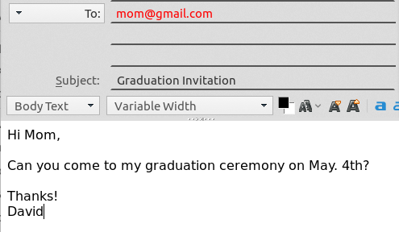

# Automatic Email composer/sender
---
## When do I need it?
Suppose you have to write 50 emails to invite your friends, teachers, family members to attend your graduation. Normally you would probably do something like this:


Receiver|Demo
---:|:---:
Mom|
Tony|
Dr. Collins|


This way, for each email, you will have to manually change the email address and name and some of its contents. When the number grows large, this can be a tedious work.


So instead of doing them manually, you can now have **a chart (.csv)** with all the information of your receivers:


num|name|address|isClose
:---:|:---:|:---:|:---:
1|mom|mom@gmail.com|y
2|tony|tony@gmail.com|y
3|Dr Collins|Dr\_Collins@gmail.com|n


As for the contents of your letter, simply have **a text document (.txt)** using bash variables
```bash
Hi ${name},

$(if [ $isClose = y ]; then echo Can you; else echo Would you like to; fi) come to my graduation ceremony on May. 4th?

Thanks!
David
```


---
## Prerequisites/dependencies
* mailx installed and properly configured

--- 
## 1\. Generate a new template
#### Execute 
```
./generate myTemplate
```
#### and the following files will be generated:
*	./templates/**myTemplate**/zh.txt
> contains letter contents in Chinese, where bash variables(defined in the first line of _XxxData.csv_) and subshell syntax can be used to compose slightly different contents based on the receiver.
*	./templates/**myTemplate**/en.txt
> contains letter contents in English. This file will be used when **isEng** is set to 'y'. Bash variables(defined in the first line of _XxxData.csv_) and subshell syntax can be used to compose slightly different contents based on the receiver.
*	./templates/**myTemplate**/subject\_zh.txt
> contains letter Subject (title) in Chinese.
*	./templates/**myTemplate**/subject\_en.txt
> contains letter Subject (title) in English. This subject will be used when **isEng** is set to 'y'.

You should edit those files directly according to your needs, and the letters will be automatically composed based on the content in them.

If you don't need to write letters in dual language, you can simply ignore the Chinese template files **(*zh.txt)** and set all **isEng** field to 'y'


#### There is one file that will NOT be generated:

* _./XxxData.csv_ (**will not be generated**)
> contains data of the receivers. You should create this file manually, whose contents should resemble the following table.

*num*|*address*|*name*|*isEng*|isClose|...
---:|:---:|:---:|:---:|:---:|---
1|xxx@gmail.com|uncle Jack|y|y|...
2|yyy@yahoo.com|Tim|y|n|...
.|.|.|.|.|...
.|.|.|.|.|...
.|.|.|.|.|...
> Where the first row is always the variable names that you will use in the template files (zh.txt, en.txt)
> Currently, the italicized variables (first 4) are necessary, so be sure to include them.
> #### A description of variables
> * **num**: a unique number identifying each receiver
> * **address**: the email address of the receiver
> * **name**: the name of the receiver
> * **isEng**: whether the receiver uses English(as opposed to Chinese)
> #### **Note**: By convention, boolean variables will have a name _isXXX_, and its true value is 'y', anything else is false.

---
## 2\. Compose letters
#### Execute
```
./compose myTemplate XxxData.csv
```
#### to compose letters.
You can browse and check the generated letters in ./letters/myTemplate/

---
## 3\. Send your letters
#### When letters are successfully composed, execute
```
./send myTemplate
```
#### and follow the interactive instruction to send letters
